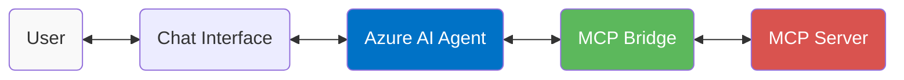
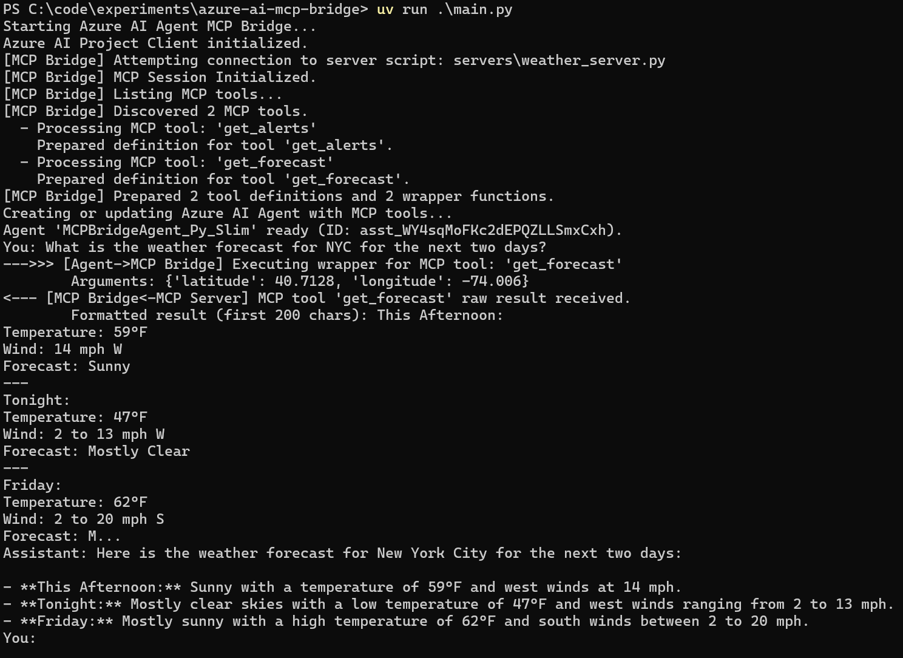

# Azure AI Agent - MCP Bridge

An experimental bridge for connecting MCP tools to Azure AI Agents. This project demonstrates how to discover and expose tools from an MCP server to Azure AI Agent Service using the Python SDK.

## Features

- **Stdio MCP Server Support:** Connects to MCP servers using stdio transport only (HTTP/SSE is not implemented yet)
- **Dynamic Tool Discovery:** Automatically finds all available tools from an MCP server
- **Schema Conversion:** Translates MCP input schemas to Azure AI-compatible function parameters
- **Azure AI Integration:** Registers discovered tools with Azure AI Agent Service
- **Interactive Console:** Test your agent immediately with a simple chat interface
- **Sample Weather Server:** Includes a ready-to-use MCP weather server for experimentation

## How it Works



1. The bridge connects to an MCP server (e.g., the included weather server) via stdio
2. It discovers available tools and generates wrapper functions for each
3. These tools are registered with an Azure AI Agent
4. When the agent needs to use a tool, the bridge:
   - Receives the request from the agent
   - Calls the appropriate MCP tool
   - Returns the result back to the agent

For a deeper technical explanation of the bridge implementation, check out the [Implementation Details](IMPLEMENTATION.md) document. It covers the architecture, components, and extension points for developers looking to modify or extend the bridge.

## Example Usage

Here's what it looks like when you run the bridge and ask for a weather forecast:



In this example:

1. The bridge connects to the weather server and discovers two tools: `get_forecast` and `get_alerts`
2. When asked about NYC weather, the agent decides to use the `get_forecast` tool
3. The bridge executes the tool with the coordinates for NYC and returns the formatted weather data
4. The agent provides a human-friendly summary of the weather forecast

## Setup

1. **Clone the repository:**

   ```bash
   git clone <your-repo-url>
   cd azure-ai-mcp-bridge
   ```

2. **Set up your environment:**

   ```bash
   python -m venv .venv
   # Windows
   .\.venv\Scripts\activate
   # MacOS/Linux
   source .venv/bin/activate
   pip install -r requirements.txt
   ```

3. **Configure Azure AI:**

   - Copy the sample environment file: `copy .env.sample .env` (Windows) or `cp .env.sample .env` (macOS/Linux)
   - Add your **Azure AI Project Connection String** to the `.env` file

4. **Run the bridge:**
   ```bash
   python main.py
   ```

## Deploying with Azure AI Agent Service

This bridge works with Azure AI Agent Service, which provides the infrastructure for your AI agents. To deploy:

1. **Set up Azure Resources:**
   - Use Microsoft's [Azure AI Agent Service Quickstart](https://learn.microsoft.com/en-us/azure/ai-services/agents/quickstart) to create the required infrastructure
   - You can use their convenient ["Deploy to Azure" button](https://learn.microsoft.com/en-us/azure/ai-services/agents/quickstart#choose-basic-or-standard-agent-setup) which automatically provisions all needed resources
2. **Configure the Bridge:**

   - Get your Project Connection String from the Azure AI Foundry portal
   - Update the `.env` file with this connection string
   - Configure your MCP server as needed (or use the included weather server)

3. **Deploy Your Agent:**
   - Run the bridge locally to register your MCP tools with the Azure AI Agent
   - Applications can then connect to your agent through the Azure AI Agent Service API

## Limitations

- **Experimental:** This is a proof-of-concept for developers to adapt and extend
- **Stdio Transport Only:** Currently only supports stdio MCP servers, not HTTP-based ones
- **Local Testing:** Designed for local development and testing, not production deployment
- **Single Server:** Currently connects to one MCP server at a time

## Project Structure

```
main.py                 # Minimal entrypoint that invokes bridge.run_bridge_chat()
IMPLEMENTATION.md       # Detailed technical documentation on the bridge implementation
azure_ai_mcp_bridge/    # Core modules
    bridge.py           # Orchestrates MCP & Azure AI Agent integration
    chat.py             # Interactive console and tool execution handling
    mcp_integration.py  # MCP client session and tool wrapper generation
servers/                # Example MCP server implementation
    weather_server.py   # MCP weather server with forecast and alerts tools
```

## License

This project is licensed under the MIT License - see the LICENSE file for details.
